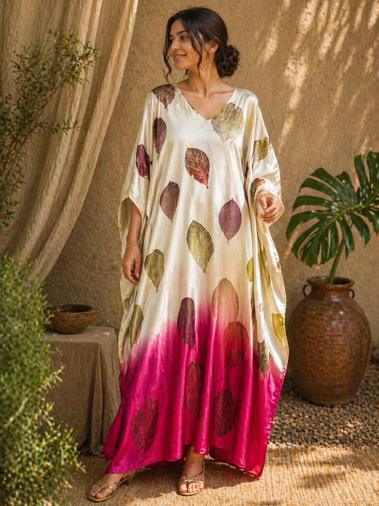

# 🌿 Tessera

**Ecoprint. Natural dye. Slow luxury.**  
Crafted garments where nature leaves its signature.

---

## ✨ Product Showcase

<table>
  <tr>
    <td align="center">
       
      <b>Black Kaftan</b> 
      
        Understated elegance. Naturally dyed. Designed to move with quiet confidence.
      
    </td>

    <td align="center">
       
      <b>Green Chanderi Kaftan</b> 
      
        Light as air. Botanical imprints flowing across luminous chanderi silk.
      
    </td>

    <td align="center">
       
      <b>Green Yellow Kaftan</b> 
      
        Sun and leaf in harmony. A vibrant expression of nature’s palette.
      
    </td>
  </tr>

  <tr>
    <td align="center">
       
      <b>Classic Kaftan</b> 
      
        The essential silhouette. Fluid, breathable, and endlessly wearable.
      
    </td>

    <td align="center">
       
      <b>Mixed Design Ecoprint</b> 
      
        Every pattern tells a story. Pressed botanicals turned into living art.
      
    </td>

    <td align="center">
       
      <b>Premium Ecoprint</b> 
      
        Crafted depth. Elevated textures shaped by time, pressure, and nature.
      
    </td>
  </tr>

  <tr>
    <td align="center">
       
      <b>Red Yellow Kaftan</b> 
      
        Bold warmth meets organic flow. A statement grounded in nature.
      
    </td>

    <td align="center">
       
      <b>Rust Coloured Kaftan</b> 
      
        Earth tones redefined. Rooted, rich, and quietly powerful.
      
    </td>

    <td align="center">
       
      <b>Yellow Kaftan Tessera</b> 
      
        Signature Tessera glow. Sunlit fabric infused with botanical soul.
      
    </td>
  </tr>

  <tr>
    <td align="center">
       
      <b>Yellow Marigold Modal</b> 
      
        Soft, radiant, effortless. Marigold tones captured in flowing modal.
      
    </td>
  </tr>
</table>

---

## 🌿 The Philosophy

We don’t print fabric.  
We collaborate with nature.

Leaves, flowers, and time shape every piece.  
No two garments are ever the same.

This is not fast fashion.  
This is **fabric grown, not made.**

---

## ✨ Discover Tessera

Slow fashion. Botanical prints. Made to be lived in.

Wear what grows. 🌱
